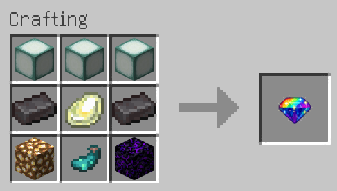

# ✨ ShinyShift [Cobblemon]

**ShinyShift** is a cross-platform mod (Fabric & NeoForge) for **Cobblemon** that allows players to convert **their own Pokémon** into shiny form using a special item.

Built with **Architectury**, designed for balance, visuals, and clean integration with Cobblemon.

---

## 🌟 Features
- ✨ Convert **owned Pokémon** into shiny form
- 🌀 Evolution-like transformation:
    - Levitation
    - Rotation
    - Glow / emissive effects
- 🔊 Custom sound & timed animation
- ⚖️ Balanced gameplay

### ❌ Restrictions
ShinyShift **will NOT work on**:
- Wild Pokémon
- Pokémon owned by other players
- Pokémon that are already shiny

---

## 💎 Item: Shiny Exchange Gem
- 🖱️ Right-click your Pokémon to activate
- 💥 Consumed on use
- ♾️ Not consumed in **Creative Mode**

---

## 🧪 Crafting Recipe

  

> The recipe is intentionally expensive to maintain progression balance.

---

## 📦 Supported Platforms
- ✅ **Fabric**
- ✅ **NeoForge**

Powered by **Architectury** for easy multi-loader support.

---

## 🧾 Requirements

### Minecraft
- **Minecraft:** `1.21.1`

### Fabric
- Fabric Loader `0.18.4+`
- Fabric API
- Cobblemon `1.7.1+`
- Architectury API `13.0.8+`

### NeoForge
- NeoForge `21.1.218+`
- Cobblemon `1.7.1+`
- Architectury API `13.0.8+`

---

## 🔧 Compatibility
- ✔ Cobblemon 1.7.x
- ✔ Java 21
- ✔ Singleplayer & Multiplayer

---

## 📜 License
**MIT License**  
© 2026 **rakoon**

You are free to use, modify, and redistribute this mod under the terms of the MIT License.
